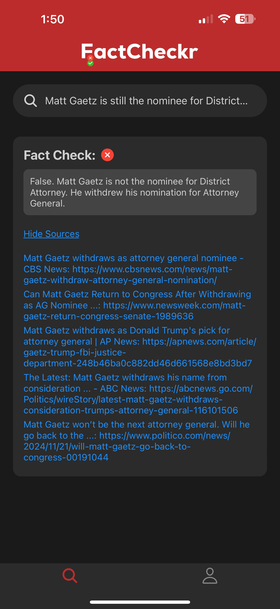

FactCheckr is a React Native application that allows users to verify the authenticity of statements using AI and Bing Search APIs. It provides results with sourced articles, ensuring accuracy and transparency.

---

## Key Features
- **Fact-Checking**: Analyze statements using GPT and Bing APIs.
- **Firebase Authentication**: Create and log into accounts with secure authentication.
- **Modern UI**: Inspired by Airbnb's clean design principles for a professional look and seamless experience.

- **Stack**:
  - React Native
  - JavaScript
  - Firebase Authentication
  - Bing Search API
  - OpenAI GPT API
- **Tools**:
  - Async Storage for session persistence.
- **Secure Implementation**:
  - Environment variables are used to protect sensitive keys.

---

## Screenshots and Features

### Fact Checking with Sources
- **True Verdict:** Statement confirmed as true.
- **False Verdict:** Statement debunked with supporting sources.
- **Disabled State:** API queries are disabled in this configuration.

  
  
  

---

### Real-Time Processing
While queries are being processed, users are shown a clean loading animation for better UX.

---

### User Authentication
Secure account creation and login powered by Firebase Authentication. Users can log in or sign up to access the app's features.

  
  

---

### Account Management
Users can view their account details, log out, or access the privacy policy directly from the account screen.

---

### Seamless Navigation
Switch between FactChecker and Account screens effortlessly using a modern bottom tab navigation bar.

  
  

